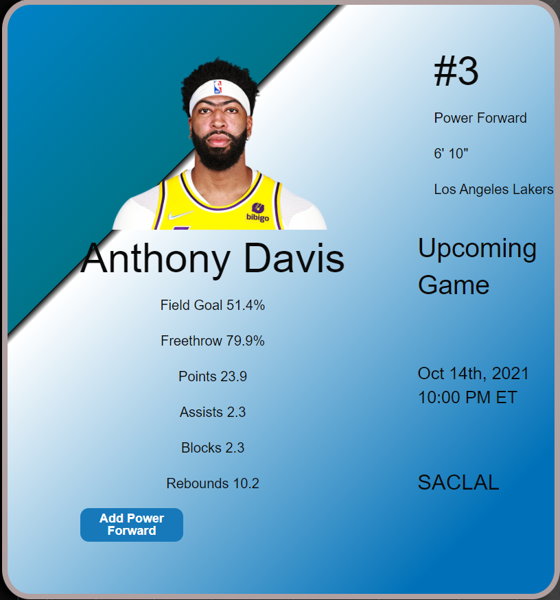
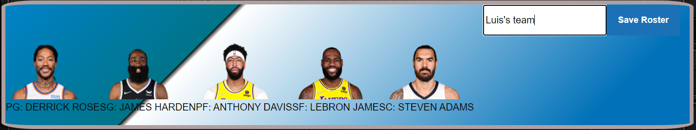

https://luis-ramirez21x.github.io/NBA-Player-Comparison-App/
# NBA Player Comparison App

This application will allow you to search up nba players and compare their stats side by side as displayed in the images below. Aside from their stats, their player cards will also display each player's upcoming games. As you search up players you can then add them to your roster by position, E.G. Center, Point-guard, Power Forward, etc. Once you have your roster you can then name and save that team and it will be saved to local storage. The app also includes a timer element that you can use to pace yourself or a friend to see who can put together the best team.


___


The API's that we used:

* [API ONE](https://data.nba.net/10s/prod/v2/2021/teams.json)
* [API TWO](http://data.nba.net/10s/prod/v1/2021/teams/hawks/schedule.json)


## Built With

* [Foundation](https://get.foundation/frameworks-docs.html) - Front-end framework
* [HTML/CSS/Javascript](https://github.com/Luis-Ramirez21x/NBA-Player-Comparison-App) - Technologies used


## Search Cards

> Individuals can write their players name and can select for their all stars if they want to! 

>In the player card two API's been used.

```js
NBA team API Documentation Retrive players name along with their recent picture and other stats such as their assists, Field goals etc.
```

```js
NBA Player Individual Stats API Documentation Retrive players that has been called by User input. This API is an intensive NBA Player API offering complete accounts for all active NBA player games and show the stats right side of the player card.
```

___
here is a demo player card screenshot.


## User team

**congratulations!**

> Selected players would fit in their general positions. 

> You can now add your teams name and **HORREYY!!** there it is, your very own All-STAR Draft TEAM!
___


## Inquiries 

> For twitter, facebook and github support, feel free to like and comment in our pages.

>User can provide us with their **Email**'s so that we can contact with you later for business purposes. 


**thank you for your support and love.**

## License
[](https://www.boost.org/LICENSE_1_0.txt)
